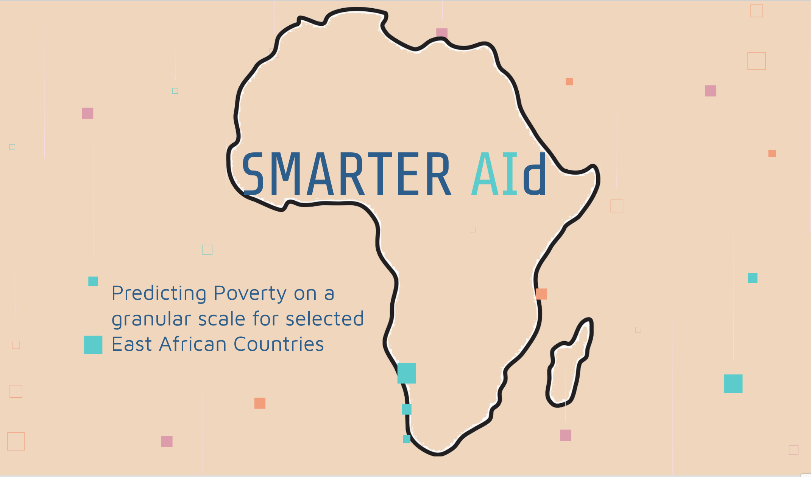

# Project--Kiva
Capstone Project: Predicting Poverty on a granular scale

## Short description:
In this project i am targeting the problem of sparse data regarding poverty in East African Countries.

It is important for NGOs or governments to have detailed information in order to maximize their impacts (by e.g. prioritize projects targeting the poorest).

I combine different data sources with ML Algorithms to predict poverty on a regional scale. 

## Content of the repo:
The notebooks are seperated by tasks. Therefore you find 4 notebooks within this repo, structured in the following way:
* 01 Kiva Data Mining & Cleaning
* 02 EDA - Kiva
* 03 External Data - Mining and EDA
* 04 Data Preprocessing and Modeling
